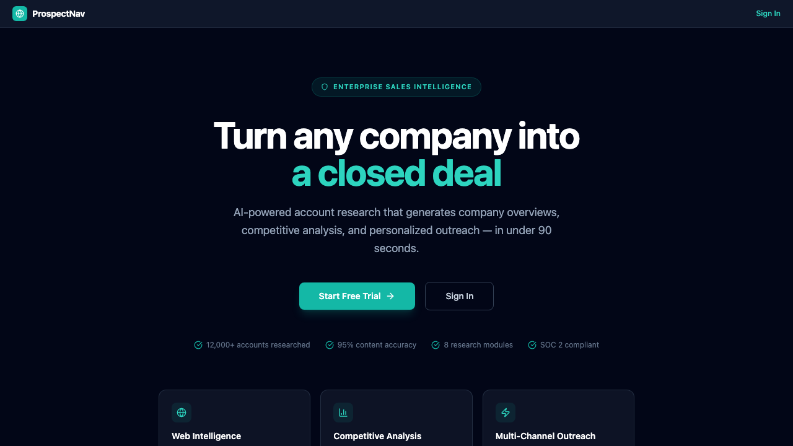
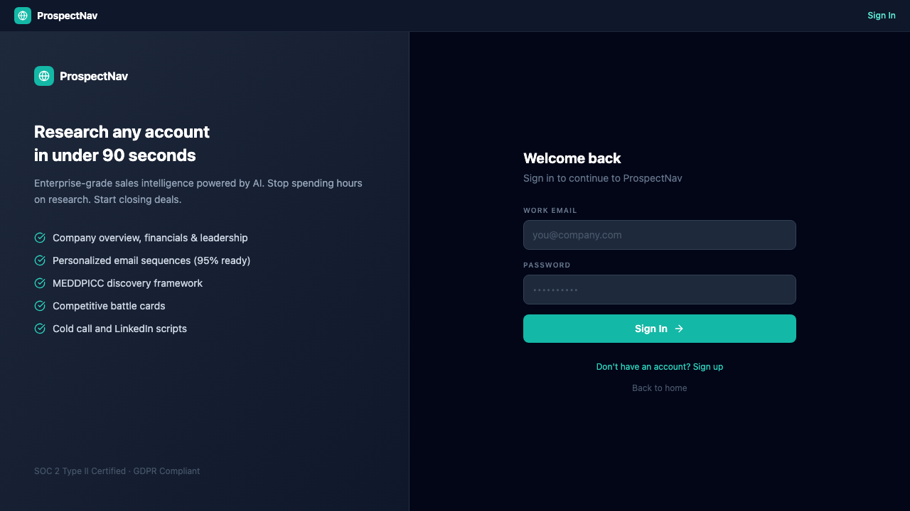
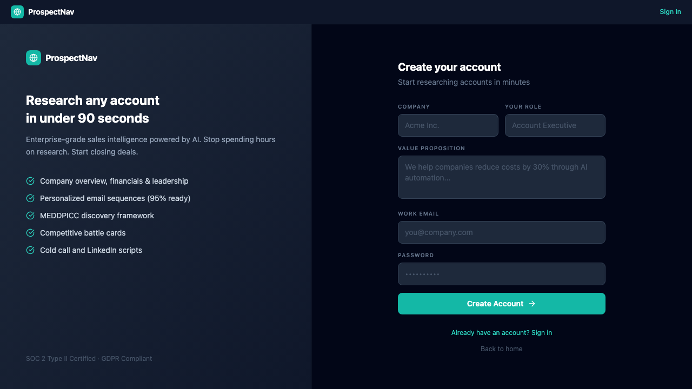

# ProspectNav

**AI-powered B2B sales intelligence that turns any company name into a complete account brief — competitive analysis, personalized outreach sequences, call scripts, and qualification frameworks — in under 90 seconds.**



---

## The Problem

Enterprise sales teams spend **5-8 hours per account** on manual research before making first contact. They cobble together data from LinkedIn, Crunchbase, news sites, SEC filings, and industry reports — then manually write emails, call scripts, and qualification notes. This process is:

- **Slow** — Reps spend more time researching than selling. At 50 accounts/month, that's 250-400 hours of research alone.
- **Inconsistent** — Quality depends on who's doing the research. Junior reps miss critical intelligence that senior reps catch instinctively.
- **Non-compounding** — Every account starts from scratch. Research doesn't build on itself or improve over time.
- **Disconnected** — Research lives in scattered notes, docs, and spreadsheets. There's no structured format that connects company intelligence to outreach strategy.

**ProspectNav replaces the entire research-to-outreach pipeline with a multi-agent AI system that produces enterprise-grade account briefs in 90 seconds.**

---

## What It Does

Enter a company name, your value proposition, and a target contact — ProspectNav's multi-agent pipeline researches the company across the live web, maps findings to your sales context, then generates **8 intelligence sections in parallel**, streaming results back in real-time.

### 8 Intelligence Modules

| Module | What It Generates | Why It Matters |
|---|---|---|
| **Company Overview** | Headquarters, leadership, revenue, funding, org structure, recent news | Foundation for any outreach — know who you're talking to |
| **Business Objectives** | Top 5 strategic priorities with success metrics and your alignment points | Frame your pitch around THEIR goals, not your features |
| **Competitive Analysis** | Incumbent vendors, competitive positioning, displacement strategy | Know what you're up against and how to differentiate |
| **Email Sequences** | 3-5 personalized emails with subject lines, timing, and follow-up cadence | Ready-to-send outreach that references real company intelligence |
| **Cold Call Script** | Opening, discovery questions, objection handling, close | Structured talk track grounded in account-specific research |
| **MEDDPICC Qualification** | Metrics, Economic Buyer, Decision Criteria/Process, Pain, Champion, Competition | Enterprise qualification framework pre-filled with real data |
| **LinkedIn Strategy** | Connection request, InMail sequence, content engagement plan | Multi-channel coordination — not just email |
| **Industry Insights** | Market trends, regulatory environment, peer benchmarks | Context that makes you sound like an industry expert |

### Live Streaming UI

Sections generate in parallel and stream to the browser via Server-Sent Events. No waiting for the full batch — you can start reading Company Overview while Competitive Analysis is still generating.

---

## Screenshots

### Landing Page

*Hero with value prop, social proof metrics, and feature cards for Web Intelligence, Competitive Analysis, and Multi-Channel Outreach.*

### Authentication

*Split-panel sign-in with feature highlights. Supabase-powered auth with email/password and Row Level Security.*


*Onboarding captures company context (name, role, value proposition) used to personalize all generated intelligence.*

### Research Generation (Authenticated)

After logging in, users enter a target company and optional contact info. The multi-agent pipeline runs:

```
┌────────────────────────────────────────────────────────┐
│  Generate Account Intelligence                          │
│                                                         │
│  Target Company: [Databricks________________]           │
│  Contact Name:   [Ali Ghodsi___] Contact Role: [CEO__]  │
│  Industry:       [Data & AI / SaaS____________]         │
│                                                         │
│  ┌─────────────────┐ ┌─────────────────┐               │
│  │ ✓ Overview      │ │ ✓ Objectives    │               │
│  │ ✓ Competitive   │ │ ⟳ Email Seqs    │               │
│  │ ⟳ Call Script   │ │ ○ MEDDPICC      │               │
│  │ ○ LinkedIn      │ │ ○ Industry      │               │
│  └─────────────────┘ └─────────────────┘               │
│                                                         │
│  [⚡ Generating (4/8 complete)...]                      │
└────────────────────────────────────────────────────────┘
```

### Account Dashboard (Authenticated)

Completed accounts appear in a sidebar. Select any account to browse its 8 intelligence tabs:

```
┌──────────┬──────────────────────────────────────────────┐
│ Accounts │  Databricks                                   │
│ ─────────│  Ali Ghodsi · CEO            Accuracy: 95%    │
│ ● Data-  ├──────────────────────────────────────────────┤
│   bricks │  Overview │ Objectives │ Competitive │ Email  │
│ ○ Stripe │           │            │             │ Seqs   │
│ ○ Notion │  ┌─────────────────────────────────────────┐ │
│          │  │ COMPANY PROFILE                         │ │
│ +New     │  │                                         │ │
│  Account │  │ Headquarters: San Francisco, CA         │ │
│          │  │ Employees: 7,000+ (42% YoY growth)      │ │
│          │  │ Revenue: $1.6B ARR (2024)               │ │
│          │  │ Latest Funding: $500M Series I @ $43B   │ │
│          │  │                                         │ │
│          │  │ STRATEGIC PRIORITIES                     │ │
│          │  │ 1. Unified analytics + AI platform...   │ │
│          │  │ 2. Enterprise expansion in EMEA...      │ │
│          │  └─────────────────────────────────────────┘ │
└──────────┴──────────────────────────────────────────────┘
```

---

## Architecture

```
Browser (React 19 + Vite)
    │
    │  POST /generate  (Server-Sent Events stream)
    ▼
FastAPI Backend (Python 3.11)
    │
    ├── Phase 1: Web Research (CrewAI Multi-Agent)
    │     ├── Researcher Agent
    │     │     ├── WebSearchTool (DuckDuckGo — 6 results per query)
    │     │     └── WebPageReaderTool (LlamaIndex — full page extraction)
    │     │
    │     └── Analyst Agent
    │           └── Maps raw research → structured sales intelligence
    │           └── Identifies key decision makers, pain points, competitive landscape
    │
    ├── Phase 2: Parallel Section Generation (asyncio)
    │     └── 8× concurrent Anthropic Claude calls
    │           ├── Each section gets full research context
    │           ├── Each section has a specialized prompt template
    │           └── Results stream back via SSE as they complete
    │
    └── Response: SSE event stream
          ├── {"type": "progress", "stage": "researching", ...}
          ├── {"type": "section", "sectionType": "overview", "content": "..."}
          ├── {"type": "section", "sectionType": "competitive", "content": "..."}
          └── {"type": "complete"}

Supabase
    ├── Auth (email/password, JWT sessions)
    ├── PostgreSQL (accounts table + sections, RLS policies)
    └── Row Level Security (users only see their own data)
```

### Why Multi-Agent Over Single-Prompt?

A single LLM call can't do real-time web research. The multi-agent architecture splits the problem:

1. **Researcher Agent** — Uses tools (web search, page reader) to gather REAL, CURRENT data about the target company. Not hallucinated — actual search results and webpage content.
2. **Analyst Agent** — Takes raw research and structures it into sales-relevant intelligence. Maps findings to the user's value proposition and selling context.
3. **Section Writers** — 8 specialized prompts run in parallel, each receiving the full research context. Each prompt is optimized for its specific output format (email vs. call script vs. qualification framework).

This means the output contains **real company data** — actual leadership names, real revenue figures, genuine recent news — not LLM confabulations.

---

## Key Technical Decisions

### Real-Time Streaming (SSE) Over Polling

The generation pipeline takes 60-90 seconds total. Instead of making users wait for all 8 sections, results stream via Server-Sent Events as each section completes. The first section typically appears in ~15 seconds.

```javascript
// Frontend SSE handling
const eventSource = new EventSource(`/generate?${params}`);
eventSource.onmessage = (event) => {
  const data = JSON.parse(event.data);
  if (data.type === "section") {
    // Render immediately — don't wait for all 8
    setSections(prev => ({...prev, [data.sectionType]: data.content}));
  }
};
```

### Parallel Section Generation

All 8 sections generate concurrently using Python's `asyncio.gather()`. Each gets the same research context but a different specialized prompt. This reduces total generation time from ~8 minutes (sequential) to ~90 seconds (parallel).

```python
# 8 sections, all at once
results = await asyncio.gather(
    generate_section("overview", params, research),
    generate_section("objectives", params, research),
    generate_section("competitive", params, research),
    generate_section("email_sequences", params, research),
    generate_section("cold_call", params, research),
    generate_section("meddpicc", params, research),
    generate_section("linkedin", params, research),
    generate_section("industry", params, research),
)
```

### Row Level Security

Every database query is scoped to the authenticated user via Supabase RLS policies. Users can never see, modify, or delete another user's accounts — enforced at the database level, not the application level.

```sql
CREATE POLICY "Users can only see own accounts"
  ON accounts FOR SELECT
  USING (auth.uid() = user_id);
```

### Onboarding Context

During signup, users provide their company name, role, and value proposition. This context is injected into every generation prompt, so the output is personalized to the user's specific selling situation — not generic.

---

## Business Outcomes

| Metric | Before ProspectNav | With ProspectNav |
|---|---|---|
| Research time per account | 5-8 hours | 90 seconds |
| Accounts researched per week | 5-10 | 50-100 |
| Outreach personalization depth | Surface-level | Company-specific with real data |
| Time to first contact | 1-2 days after assignment | Same day |
| Research consistency | Varies by rep experience | Enterprise-grade for every account |
| Intelligence format | Scattered notes | 8 structured, actionable sections |

---

## Tech Stack

| Layer | Technology | Purpose |
|---|---|---|
| Frontend | React 19 · Vite · Tailwind CSS | Fast SPA with real-time SSE rendering |
| AI Orchestration | CrewAI · LangChain | Multi-agent research + analysis pipeline |
| LLM | Anthropic Claude (Sonnet 4) | Section generation with specialized prompts |
| Web Research | DuckDuckGo Search · LlamaIndex | Real-time company intelligence gathering |
| Backend | Python 3.11 · FastAPI · asyncio | SSE streaming + parallel generation |
| Auth & Database | Supabase (PostgreSQL + RLS) | Secure multi-tenant data with row-level isolation |
| Icons | Lucide React | Consistent iconography |

---

## Project Structure

```
prospectnav-app/
├── src/
│   ├── ProspectNav.jsx            # Main app — landing, auth, generate, dashboard, platform views
│   ├── components/
│   │   └── AuthProvider.jsx       # Supabase auth context provider
│   ├── hooks/
│   │   ├── useAuth.js             # Auth state + sign in/up/out
│   │   └── useAccounts.js         # Account CRUD + SSE generation
│   └── lib/
│       ├── api.js                 # Python backend SSE client
│       ├── supabase.js            # Supabase client initialization
│       └── types.js               # Section type definitions + labels
│
├── backend/
│   ├── main.py                    # FastAPI app — /generate SSE endpoint, /health check
│   ├── crew.py                    # CrewAI agents — Researcher (search + read) + Analyst
│   ├── sections.py                # 8 section prompt templates + async Claude calls
│   └── requirements.txt           # Python dependencies
│
├── supabase/
│   ├── migrations/                # PostgreSQL schema (accounts + sections + RLS)
│   └── functions/
│       └── generate-section/      # Deno edge function (legacy direct Claude calls)
│
└── docs/
    └── screenshots/               # App screenshots
```

---

## Running Locally

### Frontend
```bash
git clone https://github.com/sami2919/prospectnav-app.git
cd prospectnav-app
npm install
cp .env.example .env.local
# Add VITE_SUPABASE_URL, VITE_SUPABASE_ANON_KEY, VITE_API_URL
npm run dev
```

### Backend
```bash
cd backend
python3 -m venv .venv && source .venv/bin/activate
pip install -r requirements.txt
cp .env.example .env
# Add ANTHROPIC_API_KEY
uvicorn main:app --host 0.0.0.0 --port 8000 --reload
```

### Supabase
1. Create a project at [supabase.com](https://supabase.com)
2. Run `supabase/migrations/20260228000000_initial.sql` in the SQL editor
3. Copy project URL + anon key to `.env.local`

### API Example
```bash
curl -N http://localhost:8000/generate \
  -H "Content-Type: application/json" \
  -d '{
    "companyName": "Stripe",
    "contactName": "Patrick Collison",
    "contactRole": "CEO",
    "industry": "Fintech / Payments",
    "ourCompany": "Acme Corp",
    "userRole": "Account Executive",
    "valueProposition": "We reduce payment processing costs by 40% with AI-powered routing"
  }'
```

Returns an SSE stream with progress events, 8 section events, and a completion event.

---

## Author

**Sami Rahman**

Built to solve the gap between knowing you should research an account and actually doing it well — every time, for every account, at enterprise quality.
